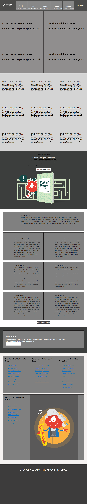

# Smashing Magazine

> Heat map of an amazing magazine to practice and submit the assignment for microverse full stack program. Made with pure css using gird system and flex-box.

## Built With

- HTML 5 and CSS 3.
- Font awesome.

## Live Demo

[Live Demo Link](https://0prodigy.github.io/smashing-magazine/)

## Getting Started

**Just fork it and fell free to use it.**

To get a local copy up and running follow these simple example steps.

### Prerequisites

Having a web browser, code editor and git.

### Install

Just fork it and you are good to go.

## Authors

👤 **Akash Pathak**

- Github: [@0prodigy](https://github.com/0prodigy)
- Twitter: [@pathakprodigy](https://twitter.com/pathakprodigy)
- Linkedin: [Akash Pathak](https://www.linkedin.com/in/akash-pathak-0796a7165)
- Email: (pathakvikash9211@gmail.com)

👤 **Hillarioh Okerio**

- Github: [@hillarioh](https://github.com/hillarioh)
- Twitter: [@hillaokri](https://twitter.com/hillaokri)
- Linkedin: [Hillarioh Okerio](www.linkedin.com/in/hillaryokerio)
- Email: (okerioh@gmail.com)

## 🤝 Contributing

Contributions, issues and feature requests are welcome!

Feel free to check the [issues page](https://github.com/0prodigy/smashing-magazine/issues).

## Show your support

Give a ⭐️ if you like this project!

## Acknowledgments

- Content inspired by the original youtube page.

## 📝 License

This project is [MIT](./LICENSE) licensed.
